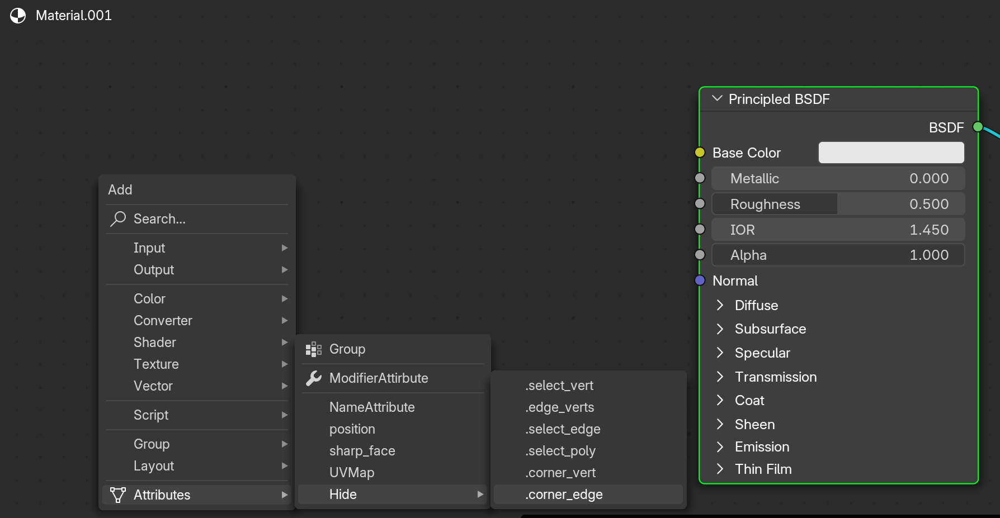
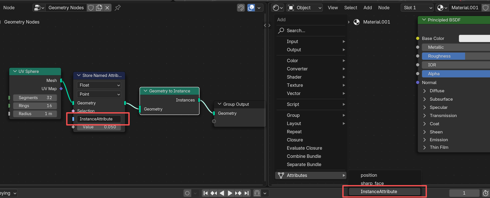

## Add Shader Attribute

> a blender addon that allows you to add attribute directly in shader nodetree instead of jumping to others views

### How it works

1. Select the object you want to add the attribute
2. Go to the shader editor (make sure you have a material assigned)
3. Shift + A > Attribute

## What's New

### v0.3.0

#### New Feature

support search attribute from instance

### v0.2.0

#### Fix

class name warning in console

#### UI Improve

1. add tips when no attribute
2. hide hidden attribute menu when there is no "." attribute

